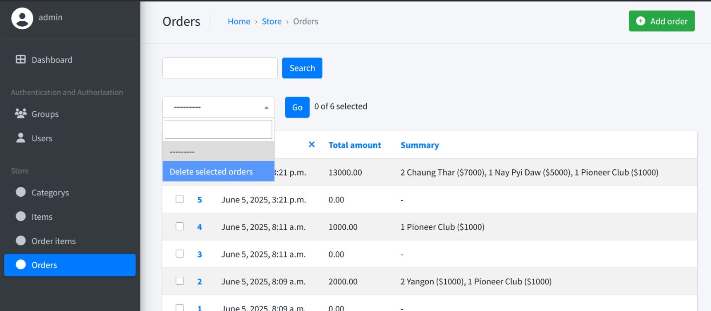

# Usage
1. Check for python installation 
`python --version`

2. Extract the zip 

3. Create Virtual Environment 
`python -m venv venv`

4. Activate Venv 
`venv\Scripts\activate` - For Windows 
or 
`source venv\bin\activate` - For Gnu/Linux (UNIX) or MacOS 

5. Install Requirements 
`pip install -r requirements.txt`

7. Apply Database Migrations(if required) 
`python manage.py migrate`

6. Run server 
`python manage.py runserver` 
or 
ctrl + Left Mouse Button http://127.0.0.1:8000/ 

# Admin Panel
Go to localhost:8000/admin

# Deletion
There is a special case on deletion as you will to need to switch options and it is a little hidden

Please View the image if there should be any confusion
